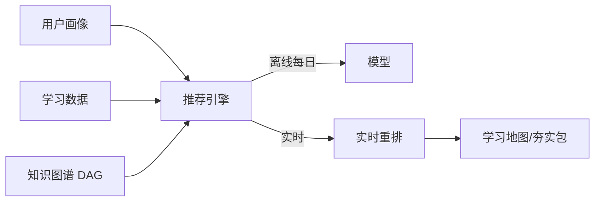

# FRD-个性化学习路径

> 域缩写 `PTH`。展开 `PRD-主文档.md` §7.6 的 6 项需求。
> 关联 PLAN：二.5 个性化学习路径。

---

## FR-PTH-001 推荐引擎-三维（画像/数据/图谱）
- 优先级：P1 · 里程碑：M2 · 关联 PLAN：二.5 推荐引擎
- 功能描述：基于「用户画像（年级、目标）+ 学习数据（正确率、薄弱点、时长）+ 知识图谱（依赖关系）」三维推荐。
- 架构：离线训练（每日更新协同过滤/知识追踪模型）+ 实时捕获当前行为动态调整（见 `系统架构设计.md` 实时推荐管道）。
- 验收标准：新行为（如刚完成听力训练）在当次会话影响后续推荐；离线模型每日刷新。

## FR-PTH-002 新用户基础夯实包
- 优先级：P0 · 里程碑：M1 · 关联 PLAN：二.5 新用户
- 功能描述：入学测评（`FR-CRS-006`）定级后，推荐「基础夯实包」（词汇+语法入门）。
- 验收标准：新用户首屏即见夯实包入口，随定级结果变化。

## FR-PTH-003 老用户动态路径调整
- 优先级：P1 · 里程碑：M2 · 关联 PLAN：二.5 老用户
- 功能描述：动态调整路径（听力薄弱→增加听力占比；发音错误多→推荐音标专项课）。
- 验收标准：薄弱点变化触发推荐权重变化，有解释文案。

## FR-PTH-004 目标导向推荐（考试/兴趣）
- 优先级：P1 · 里程碑：M2 · 关联 PLAN：二.5 目标导向
- 功能描述：考试冲刺用户优先真题解析+高频考点；兴趣拓展用户推荐动画/歌曲主题课（见 `FR-CRS-004`）。
- 验收标准：学习目标字段（见 `FR-ACC-004`）驱动推荐分支。

## FR-PTH-005 学习地图可视化
- 优先级：P1 · 里程碑：M2 · 关联 PLAN：二.5 路径可视化
- 功能描述：以「学习地图」展示 L1→L6 共 20 个关卡，显示当前位置、下一目标、所需努力（"再掌握 50 个单词即可解锁 L2"）。
- 验收标准：地图节点状态（未解锁/进行中/已通关）与进度一致；解锁条件可配置。

## FR-PTH-006 知识图谱依赖关系（DAG）
- 优先级：P1 · 里程碑：M2 · 关联 PLAN：二.5 知识图谱
- 功能描述：知识点依赖关系以 DAG 表达（MySQL 关系表），支撑先修约束与薄弱传播。
- 验收标准：前置未掌握时，后续内容在路径中后置；依赖环检测告警。

---

### 推荐链路

