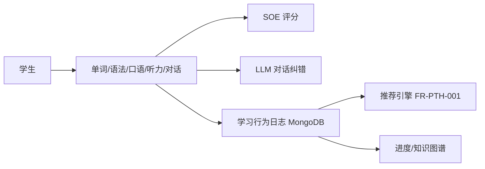

# FRD-互动学习模块

> 域缩写 `LRN`。展开 `PRD-主文档.md` §7.3 的 12 项需求。含单词/语法/口语/听力/对话五子模块。

> **关键勘误**：PLAN 中口语评测写「腾讯云慧眼」，实为**智聆口语评测 SOE**（音素级）。见 `03-engineering/技术选型对比与决策.md`。

---

## 一、单词记忆

### FR-LRN-001 多模态记忆（图像/口型/情景）
- 优先级：P0 · 里程碑：M1 · 关联 PLAN：二.2 单词记忆
- 功能描述：单词配「图像联想 + 发音口型动画 + 例句情景视频」（如 apple：苹果图+口型动画+"I eat an apple"视频）。
- 验收标准：每个核心词具备图、音、景三要素（资源缺失时可降级为文字+音频）。

### FR-LRN-002 复习调度（艾宾浩斯+错误率）
- 优先级：P0 · 里程碑：M1 · 关联 PLAN：二.2 记忆算法
- 功能描述：基于艾宾浩斯遗忘曲线 + 用户错误率/反应时长动态调整复习间隔。
- 主流程：学习记录写入 → 调度引擎计算下次复习时间 → 生成每日复习队列（XXL-Job 定时）。
- 验收标准：错误率高的词进入更短复习周期；复习完成回写熟练度。

### FR-LRN-003 单词闯关游戏化
- 优先级：P1 · 里程碑：M2 · 关联 PLAN：二.2 游戏化激励
- 功能描述：单词闯关，解锁新关卡需掌握前序单词。
- 验收标准：关卡解锁状态持久化，与掌握度联动（见 `FR-TRK-003`）。

### FR-LRN-004 拼写 PK
- 优先级：P2 · 里程碑：M3
- 功能描述：与 AI 或同学对战拼写（实时/异步）。
- 验收标准：PK 结果计入积分（见 `FR-OPS-001`）。

## 二、语法练习

### FR-LRN-005 情景化练习（改错/填空）
- 优先级：P0 · 里程碑：M1 · 关联 PLAN：二.2 语法练习
- 功能描述：通过对话改错题、故事语境语法填空强化应用，避免纯刷题。
- 验收标准：题干支持富文本与语境上下文展示。

### FR-LRN-006 语法即时反馈（知识点讲解）
- 优先级：P0 · 里程碑：M1 · 关联 PLAN：二.2 即时反馈
- 功能描述：错误时弹出知识点讲解（如"这里用了一般过去时，因为动作发生在昨天"），正确时展示拓展用法。
- 验收标准：反馈内容来自知识点库，支持外链复习（见 `FR-TRK-002`）。

## 三、口语跟读

### FR-LRN-007 口语跟读-音素级评分（SOE）
- 优先级：P0 · 里程碑：M1 · 关联 PLAN：二.2 口语跟读
- 功能描述：基于 ASR + 腾讯云智聆口语评测 SOE，从准确度（音素级）、流利度（语速/停顿）、完整度三维度打分 0-100。
- 主流程：
  1. 端侧降噪 + VAD 静音检测 → 音频分片上传。
  2. 云端 SOE 评分 → 实时分数经 WebSocket/SSE 推送（P95 ≤1s）。
  3. 异步生成音素级详细报告（≤10s）→ 落库并更新进度。
- 异常与边界：
  - E1：iOS Safari 需用户手势触发录音；后台切换中断 → 本地缓存后重传，失败降级为文本跟读。
  - E2：SOE 服务不可用 → 降级为本地基础打分并提示稍后补评。
- 验收标准：三维度分数可分别展示；严格度参数生效（见 `FR-ACC-005`）。

### FR-LRN-008 口语对比纠音（波形/音素高亮）
- 优先级：P0 · 里程碑：M1 · 关联 PLAN：二.2 对比纠音
- 功能描述：播放标准发音（原声/AI TTS）+ 用户录音波形对比，标注错误音素（如 /θ/ 发成 /s/）。
- 验收标准：错误音素以色标（红/黄/绿）高亮，可单句重听。

## 四、听力训练

### FR-LRN-009 梯度难度+三步法
- 优先级：P0 · 里程碑：M1 · 关联 PLAN：二.2 听力训练
- 功能描述：难度从单词辨音→短句理解→长对话→篇章听力递进；交互支持「盲听→看文本听→跟读」三步。
- 验收标准：三步进度可独立标记完成。

### FR-LRN-010 单句循环/变速
- 优先级：P1 · 里程碑：M2 · 关联 PLAN：二.2 交互设计
- 功能描述：关键句支持单句循环、0.8x-1.2x 变速（复用 `FR-CRS-008` 播放器）。
- 验收标准：变速与单句循环状态互不影响。

## 五、对话训练

### FR-LRN-011 AI 角色扮演多轮
- 优先级：P1 · 里程碑：M2 · 关联 PLAN：二.2 对话训练
- 功能描述：AI 虚拟伙伴（餐厅服务员/外国同学）支持多轮对话（点餐→询问口味→结账）。
- 主流程：选择场景 → LLM 驱动多轮对话 → 意图识别 → 实时引导。
- 验收标准：对话上下文保持；超出能力范围时优雅引导回主题。

### FR-LRN-012 对话实时反馈+报告
- 优先级：P1 · 里程碑：M2 · 关联 PLAN：二.2 实时反馈
- 功能描述：对话中 AI 识别意图，错误时引导修正（如"You can say 'I'd like a hamburger, please'"）；结束生成「对话流畅度+语法正确性」报告。
- 验收标准：报告可查看并计入能力雷达图（见 `FR-TST-005`）。

---

### 互动学习模块数据流

