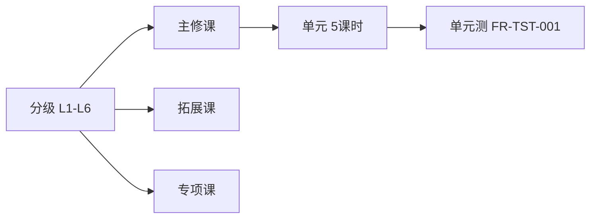

# FRD-分级课程体系

> 域缩写 `CRS`。展开 `PRD-主文档.md` §7.2 的 8 项需求。

---

## FR-CRS-001 分级标准 L1-L6 对齐 CEFR/新课标
- 优先级：P0 · 里程碑：M1 · 关联 PLAN：二.1 标准对齐
- 功能描述：建立 L1-L6 分级框架，对齐 CEFR（Pre-A1~A2/B1）与 2022 版义务教育英语课标。
- 验收标准：每级可追溯到 CEFR 子级与课标学业质量描述。

## FR-CRS-002 每级词汇量/语法/能力目标配置
- 优先级：P0 · 里程碑：M1 · 关联 PLAN：二.1 课程形态
- 功能描述：每级配置词汇量（L1:300、L6:1500）、语法点（L3 掌握一般现在时）、听说读写能力目标。
- 验收标准：目标以结构化数据存于课程元数据（见 `03-engineering/数据字典.md` DE-课程级别）。

## FR-CRS-003 主修课（动画课 5-8 分钟）
- 优先级：P0 · 里程碑：M1 · 关联 PLAN：二.1 课程形态
- 功能描述：体系化动画课，含情景对话、知识点讲解，单课 5-8 分钟。
- 主流程：进入课程 → 播放动画 → 知识点卡片 → 课末小结 → 标记完成。
- 验收标准：单课时长可被配置与统计；完成事件驱动进度（见 `FR-TRK-001`）。

## FR-CRS-004 拓展课（主题微课）
- 优先级：P1 · 里程碑：M2 · 关联 PLAN：二.1 课程形态
- 功能描述：主题式场景微课（如「餐厅点餐」「校园社交」），强化场景应用。
- 验收标准：可按主题标签检索与推荐（见 `FR-PTH-004`）。

## FR-CRS-005 专项课（薄弱项训练包）
- 优先级：P1 · 里程碑：M2 · 关联 PLAN：二.1 课程形态
- 功能描述：针对薄弱项（音标、时态）的强化训练包，由路径引擎推荐。
- 验收标准：专项课与知识图谱薄弱点可联动（见 `FR-PTH-003`、`FR-TRK-002`）。

## FR-CRS-006 入学测评-定级（听力/口语/词汇）
- 优先级：P0 · 里程碑：M1 · 关联 PLAN：二.1 动态分级
- 功能描述：入学前通过听力辨音、口语发音、词汇量测试确定初始级别。
- 主流程：
  1. 学生完成 3 项子测评（听力辨音、口语发音 SOE、词汇量抽样）。
  2. 引擎综合打分 → 推荐初始级别（如 L3）。
  3. 家长/学生确认或手动微调。
- 异常与边界：
  - E1：麦克风不可用 → 降级为词汇+听力定级，口语项可补测。
- 验收标准：定级结果与 CEFR 子级映射一致；结果写入用户画像。

## FR-CRS-007 动态升降级规则
- 优先级：P1 · 里程碑：M2 · 关联 PLAN：二.1 动态分级
- 功能描述：学习过程中按测评结果动态调整（如连续 3 次单元测满分可跳级；连续低于阈值可降级巩固）。
- 验收标准：升级/降级触发有审计日志，家长端可收到通知（见 `FR-TRK-006`）。

## FR-CRS-008 课程播放器（字幕/复读/变速）
- 优先级：P0 · 里程碑：M1 · 关联 PLAN：二.2 听力训练、二.1
- 功能描述：通用课程播放器，支持字幕开关、AB 复读、0.8x-1.2x 变速；TTS 跟读示范。
- 验收标准：变速不影响音素对齐；复读区间可标记。

---

### 课程形态关系

