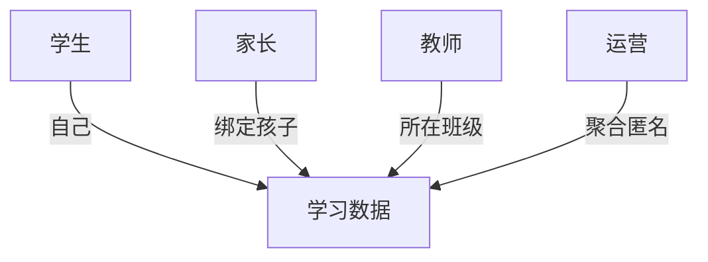

# FRD-学习进度追踪

> 域缩写 `TRK`。展开 `PRD-主文档.md` §7.5 的 10 项需求。
> 关联 PLAN：二.3 学习进度追踪（学生端/家长端/教师端）。

---

## 一、学生端

### FR-TRK-001 学生仪表盘
- 优先级：P0 · 里程碑：M1 · 关联 PLAN：二.3 学生端
- 功能描述：展示今日学习时长、掌握单词数、口语平均分、课程完成率等核心指标。
- 验收标准：指标实时（T+1 汇总不超时）且口径与数据字典一致。

### FR-TRK-002 知识图谱可视化（薄弱点跳转复习）
- 优先级：P1 · 里程碑：M2 · 关联 PLAN：二.3 知识图谱
- 功能描述：可视化已掌握/薄弱知识点（如"一般过去时 80%，现在完成时 50%"），点击跳转复习。
- 验收标准：节点掌握度来自学习数据聚合；点击跳转对应专项课/练习。

### FR-TRK-003 成就系统-勋章
- 优先级：P1 · 里程碑：M2 · 关联 PLAN：二.3 成就系统
- 功能描述：解锁「单词小能手」「口语达人」等勋章，累计进度可视化。
- 验收标准：勋章触发规则可配置，不与积分重复计发。

### FR-TRK-004 积分兑换虚拟道具
- 优先级：P2 · 里程碑：M3 · 关联 PLAN：二.3 成就系统
- 功能描述：积分兑换虚拟道具（如学习主题皮肤）。
- 验收标准：兑换消耗积分并下发道具，余额一致（Outbox 保证）。

## 二、家长端（Web/小程序）

### FR-TRK-005 家长端-学习报告（周/月）
- 优先级：P0 · 里程碑：M1 · 关联 PLAN：二.3 家长端
- 功能描述：查看孩子学习报告（周/月维度）：时长、完成率、能力变化。
- 验收标准：报告按家长维度隔离，仅可见绑定孩子数据。

### FR-TRK-006 家长端-异常提醒
- 优先级：P1 · 里程碑：M2 · 关联 PLAN：二.3 实时同步
- 功能描述：异常提醒（连续 3 天未学习、测评成绩下滑）。
- 验收标准：提醒触发有阈值配置；微信/短信推送可达。

### FR-TRK-007 家长端-学习时段锁
- 优先级：P0 · 里程碑：M1 · 关联 PLAN：二.3 权限控制
- 功能描述：设置学习时段锁（如 19:00-20:00 仅允许学习，禁止游戏/无关功能）。
- 验收标准：锁定时段内非学习内容不可进入，前端+后端双重校验。

### FR-TRK-008 家长端-学习记录详情查看
- 优先级：P1 · 里程碑：M2 · 关联 PLAN：二.3 权限控制
- 功能描述：查看具体学了哪课、错了哪些题。
- 验收标准：明细可下钻到单次作答记录（脱敏）。

## 三、教师端（B 端，可选）

### FR-TRK-009 教师端-班级管理看板
- 优先级：P2 · 里程碑：M3 · 关联 PLAN：二.3 教师端
- 功能描述：班级整体进度（80% 完成 L3）、薄弱点分布（60% 混淆时态）。
- 验收标准：看板按班级聚合，数据来自学习行为日志。

### FR-TRK-010 教师端-作业布置与统计
- 优先级：P2 · 里程碑：M3 · 关联 PLAN：二.3 教师端
- 功能描述：一键布置单词背诵/口语跟读，自动统计完成率与正确率。
- 验收标准：作业下发到学生端任务流；统计实时更新。

---

### 多角色数据可见性

