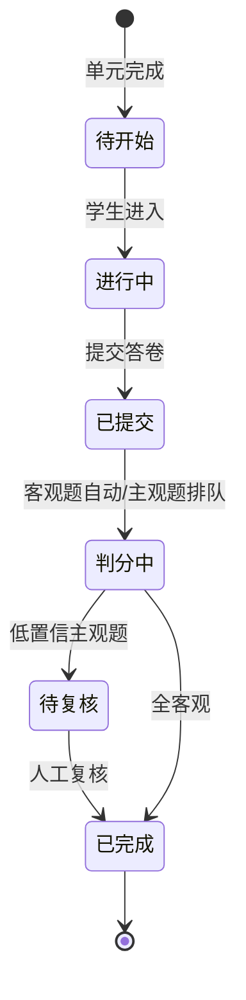

# FRD-评测体系

> 域缩写 `TST`。展开 `PRD-主文档.md` §7.4 的 7 项需求。
> 关联 PLAN：二.6 评测体系。

---

## FR-TST-001 单元测-听说读写为综合测评
- 优先级：P0 · 里程碑：M1 · 关联 PLAN：二.6 单元测
- 功能描述：每学完约 5 课时进行听-说-读-写综合测评。
- 主流程：触发单元测 → 客观题（听/读/写选择填空）→ 口语题（SOE 评测）→ 提交。
- 验收标准：单元测与课程单元强绑定，未学完不开放。

## FR-TST-002 客观题自动判分
- 优先级：P0 · 里程碑：M1 · 关联 PLAN：二.6 客观题自动判分
- 功能描述：客观题（选择/填空/听力选择）自动判分，实时反馈正确率。
- 验收标准：判分准确率 100%（标准答案唯一）；结果写入成绩表。

## FR-TST-003 主观题 AI+人工复核
- 优先级：P1 · 里程碑：M2 · 关联 PLAN：二.6 主观题
- 功能描述：口语/写作由 AI（SOE/LLM 批改）初评 + 人工抽检复核。
- 验收标准：人工复核队列按置信度排序，低置信优先；复核结果回流优化模型。

## FR-TST-004 阶段测-模拟考（对接中考/小升初）
- 优先级：P1 · 里程碑：M2 · 关联 PLAN：二.6 阶段测
- 功能描述：每学期/级别末模拟考，对接中考/小升初题型。
- 验收标准：题型库可配置；成绩纳入能力雷达图与升降级评估（见 `FR-CRS-007`）。

## FR-TST-005 能力雷达图
- 优先级：P1 · 里程碑：M2 · 关联 PLAN：二.6 能力雷达图
- 功能描述：生成词汇/语法/听力/口语/阅读/写作六维能力雷达图（ECharts）。
- 验收标准：六维分值来自对应测评数据；可查看历史趋势对比。

## FR-TST-006 月度竞赛活动
- 优先级：P2 · 里程碑：M3 · 关联 PLAN：二.6 竞赛活动
- 功能描述：每月「口语达人赛」「单词拼写王」，获奖者获证书+积分。
- 验收标准：活动页可报名、排行、发奖；证书可导出。

## FR-TST-007 测评成绩与报告存储/查询
- 优先级：P0 · 里程碑：M1 · 关联 PLAN：三.2 数据一致性
- 功能描述：测评成绩、报告（含音素详情）持久化与查询（学生/家长端）。
- 验收标准：成绩与进度更新通过本地事务+Outbox 保证最终一致（见 `系统架构设计.md`）。

---

### 评测状态机

