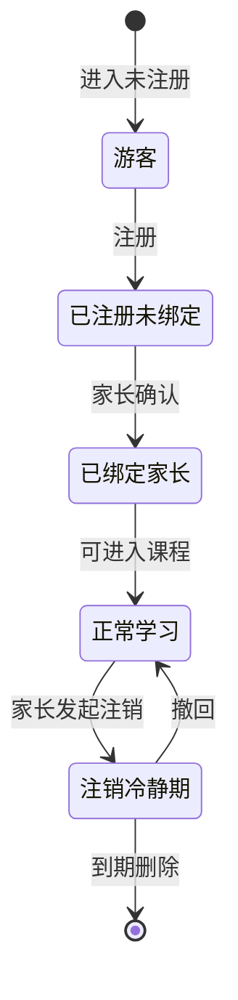

# FRD-账号与多角色

> 域缩写 `ACC`。本册展开 `PRD-主文档.md` §7.1 的 10 项需求。
> 编号唯一登记于 `PRD-主文档.md` 需求总表，本章仅展开细节。

---

## FR-ACC-001 手机号/微信注册登录
- 优先级：P0 · 里程碑：M1 · 关联 PLAN：二.4 注册登录
- 功能描述：支持手机号验证码、微信 OAuth 一键登录两种方式；登录后建立统一用户中心。
- 前置条件：用户已访问 Web/H5 端。
- 主流程：
  1. 用户选择「手机号登录」输入手机号 → 获取短信验证码 → 校验通过建立会话。
  2. 或选择「微信登录」→ 跳转授权 → 首次登录自动创建账号并绑定微信 openid。
- 异常与边界：
  - E1：验证码 60s 内重复获取 → 禁用按钮并倒计时。
  - E2：验证码错误超 5 次 → 锁定 10 分钟并提示。
  - E3：微信授权失败 → 回退手机号登录入口。
- 验收标准：
  - AC1：两种登录方式均可在 30s 内完成。
  - AC2：同一微信 openid 不重复建号。

## FR-ACC-002 学生账号绑定家长手机号（合规）
- 优先级：P0 · 里程碑：M1 · 关联 PLAN：二.4 学生账号需绑定家长手机号
- 功能描述：6-15 岁学生注册后必须绑定家长手机号（合规强制），未绑定前仅可体验游客模式。
- 前置条件：已创建学生账号。
- 主流程：
  1. 注册学生账号 → 引导绑定家长手机号 → 家长短信确认 → 绑定关系建立。
  2. 绑定后学生账号状态置为「已实名关联」。
- 异常与边界：
  - E1：家长手机号与学生手机号相同 → 提示需不同号码。
  - E2：家长拒绝确认 → 账号保持游客限制状态。
- 验收标准：
  - AC1：未绑定家长手机号的学生账号无法进入正式课程（仅 3 节体验）。
  - AC2：`FR-ACC-010` 解绑/删除链路可逆向生效。

## FR-ACC-003 游客模式（限 3 节免费课）
- 优先级：P0 · 里程碑：M1 · 关联 PLAN：二.4 游客模式
- 功能描述：未注册用户可体验 3 节免费课，引导注册转化。
- 主流程：进入 → 分配游客标识（localStorage + 服务端临时态）→ 可学 3 节 → 第 4 节引导注册。
- 验收标准：体验计数跨会话持久，超出即弹注册引导。

## FR-ACC-004 个人中心-基础信息
- 优先级：P0 · 里程碑：M1 · 关联 PLAN：二.4 个人中心
- 功能描述：头像、昵称、年级、学习目标（小升初冲刺/提升口语等）。
- 验收标准：年级字段驱动课程分级推荐默认值。

## FR-ACC-005 学习偏好设置（提醒/严格度）
- 优先级：P1 · 里程碑：M2
- 功能描述：每日学习提醒时间、口语评测严格度（宽松/标准/严格）。
- 验收标准：严格度影响 SOE 评分阈值与纠音灵敏度（见 `FR-LRN-007`）。

## FR-ACC-006 社交-学习好友（家长同意）
- 优先级：P1 · 里程碑：M2 · 关联 PLAN：二.4 社交互动
- 功能描述：添加学习好友需家长授权（二次确认）。
- 验收标准：未获家长同意的添加请求不建立关系。

## FR-ACC-007 好友学习排名（隐私脱敏）
- 优先级：P1 · 里程碑：M2
- 功能描述：好友榜仅显示昵称+积分，不展示真实姓名/学校。
- 验收标准：排名接口返回字段不含 PII。

## FR-ACC-008 组队单词打卡挑战
- 优先级：P2 · 里程碑：M3
- 功能描述：组队完成单词打卡挑战，团队进度可视化。
- 验收标准：组内成员完成度聚合展示，达标发团队勋章。

## FR-ACC-009 多端登录与会话管理
- 优先级：P0 · 里程碑：M1 · 关联 PLAN：三.1/数据层 Redis
- 功能描述：Web/H5 共享会话（Redis 存储），支持「踢下线/设备列表查看」。
- 验收标准：同账号多端在线，Token 刷新不冲突；可远程注销设备。

## FR-ACC-010 账号注销与数据删除（合规）
- 优先级：P0 · 里程碑：M1 · 关联 PLAN：五 隐私保护
- 功能描述：家长可发起账号注销并删除孩子数据（加密删除/脱敏归档）。
- 主流程：家长验证 → 提交注销 → 进入 7 天冷静期 → 到期物理删除或导出。
- 验收标准：注销后学习记录、录音元数据按《个人信息保护法》删除/脱敏。

---

### 状态机：学生账号生命周期

