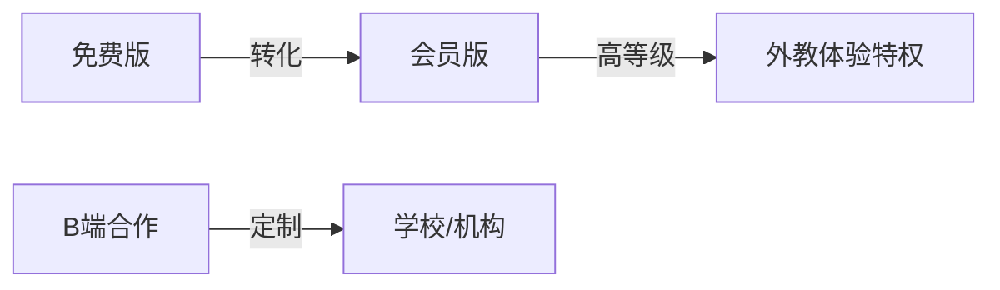

# FRD-运营激励与商业化

> 域缩写 `OPS`。展开 `PRD-主文档.md` §7.7 的 10 项需求。
> 关联 PLAN：四 运营与商业化、二.3 成就系统、五 防沉迷。

---

## FR-OPS-001 成长体系-积分/等级/特权
- 优先级：P1 · 里程碑：M2 · 关联 PLAN：四 用户激励
- 功能描述：积分→等级→特权（高等级解锁外教 1v1 体验课等）。
- 验收标准：等级规则可配置；特权与等级绑定校验（后端强制）。

## FR-OPS-002 邀请有礼
- 优先级：P2 · 里程碑：M3 · 关联 PLAN：四 用户激励
- 功能描述：邀请好友注册双方获积分。
- 验收标准：防刷（同设备/同 IP 限制）；奖励发放经 Outbox 保证一致。

## FR-OPS-003 免费版功能边界
- 优先级：P0 · 里程碑：M1 · 关联 PLAN：四 商业化
- 功能描述：免费版含基础课程 + 有限评测（如每日 3 次口语跟读）。
- 验收标准：超限时引导开通会员；边界由配置中心控制，前端提示+后端拦截。

## FR-OPS-004 会员版（无限评测/报告/无广告）
- 优先级：P1 · 里程碑：M2 · 关联 PLAN：四 商业化
- 功能描述：会员解锁全部课程 + 无限评测 + 个性化报告 + 无广告。
- 验收标准：会员态影响功能开关与配额；到期自动回退免费边界。

## FR-OPS-005 B 端合作-班级平台/定制课程
- 优先级：P2 · 里程碑：M3 · 关联 PLAN：四 商业化
- 功能描述：向学校/机构输出班级管理平台+定制课程，按年收费。
- 验收标准：B 端租户隔离；课程可定制且不影响 C 端标准库。

## FR-OPS-006 运营后台-课程与题库编排
- 优先级：P2 · 里程碑：M3 · 关联 PLAN：四 内容运营
- 功能描述：课程、题库、活动编排后台。
- 验收标准：编排结果经内容审核（见 `FR-OPS-007`）后生效。

## FR-OPS-007 运营后台-内容审核
- 优先级：P1 · 里程碑：M2 · 关联 PLAN：五 内容合规
- 功能描述：课程内容经教育专家审核（避免文化偏见、不当价值观），音视频资源版权校验。
- 验收标准：未审核内容不可对学生发布；审核留痕。

## FR-OPS-008 运营后台-数据看板
- 优先级：P2 · 里程碑：M3 · 关联 PLAN：四 内容运营
- 功能描述：运营数据看板（DAU/留存/转化/内容使用率）。
- 验收标准：指标与北极星指标（见 `PRD-主文档.md` §5）对齐。

## FR-OPS-009 防沉迷-单次时长提醒
- 优先级：P0 · 里程碑：M1 · 关联 PLAN：五 防沉迷
- 功能描述：连续学习 30 分钟弹出休息提示。
- 验收标准：前端定时器 + 后端学习时长校验双保险；可一键忽略（计次）。

## FR-OPS-010 防沉迷-每日学习上限（家长设）
- 优先级：P0 · 里程碑：M1 · 关联 PLAN：五 防沉迷
- 功能描述：家长可设每日学习上限（如最多 60 分钟），超限锁学习功能。
- 验收标准：上限与家长账号绑定；达限后学生端进入休息态，家长可临时调整。

---

### 商业化分层

