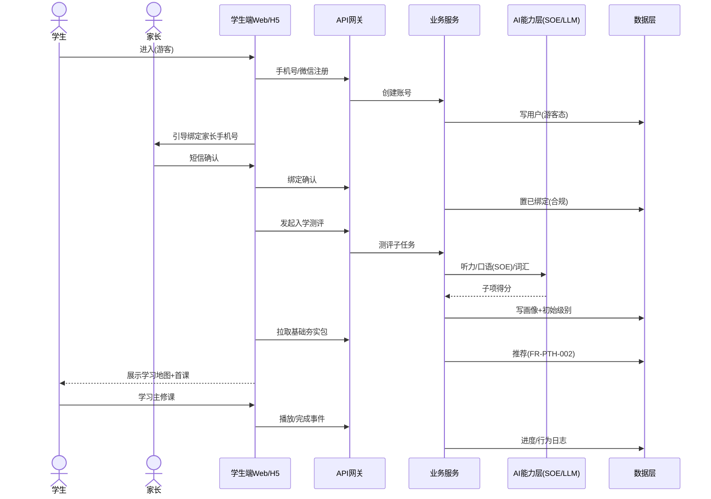
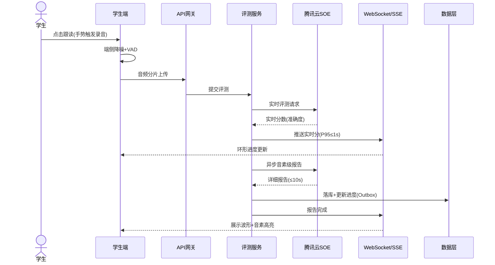
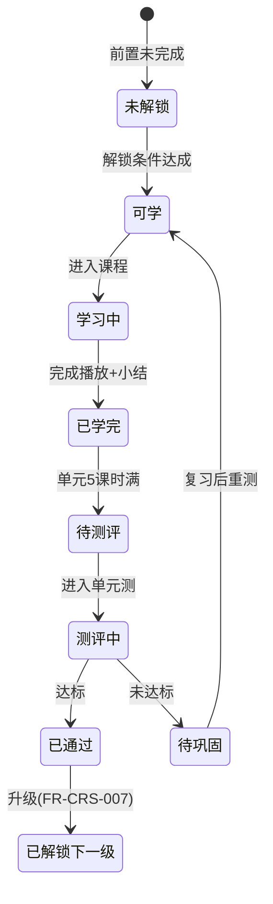

# 核心交互流程说明

> 覆盖「注册 → 定级 → 选课 → 学习 → 测评 → 推荐」全链路。流程图均用 Mermaid。

## 1. 新用户首日全链路（时序图）



## 2. 口语跟读实时评分链路



## 3. 学习状态机（课程单元）



## 4. 推荐引擎触发时机

```mermaid
flowchart TD
  A[用户行为] --> B{实时?}
  B -->|是(刚完成听力)| C[实时重排: 加权听力拓展]
  B -->|否(每日)| D[离线模型刷新]
  C --> E[学习地图/夯实包更新]
  D --> E
```

## 5. 异常与边界要点（跨流程）
- 录音中断（iOS 后台切换）：本地缓存音频 → 失败重传 → 仍失败降级文本跟读（见 `FR-LRN-007` E1）。
- SOE 不可用：本地基础分 + 稍后补评提示。
- 未绑定家长手机号：阻断正式课程，仅游客 3 节（见 `FR-ACC-002`）。
- 防沉迷达限：学生端进入休息态，家长可临时调整（见 `FR-OPS-010`）。
- 数据一致性：学习记录-进度-积分通过 Outbox 事件表保证最终一致（见 `系统架构设计.md`）。
