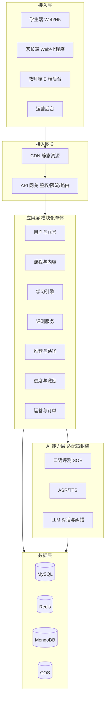

# 系统架构设计

> 依据 `技术选型对比与决策.md` 的推荐结论展开。本期形态：Spring Boot 模块化单体 + API 网关 + 腾讯云 AI 能力，Web/H5 前端。

## 1. 分层架构



## 2. 模块划分与职责

| 模块 | 职责 | 依赖 |
| --- | --- | --- |
| 用户与账号 M1 | 注册登录、家长绑定、个人中心、会话 | Redis、MySQL |
| 课程与内容 M2 | 分级课程、题库、播放器元数据 | MySQL、COS |
| 学习引擎 M3 | 单词/语法/口语/听力/对话五模块业务 | AI、MongoDB |
| 评测服务 M4 | 单元测/阶段测判分、SOE 调度、报告 | AI、MySQL |
| 推荐与路径 M5 | 三维推荐、学习地图、知识图谱 DAG | MySQL、Redis |
| 进度与激励 M6 | 仪表盘、勋章、积分、防沉迷 | MySQL、Redis、MongoDB |
| 运营与订单 M7 | 会员、B 端租户、内容审核、活动 | MySQL、Redis |

## 3. 关键设计决策

### 3.1 AI 适配器抽象
定义 `SpeechEvaluationPort`、`SpeechSynthesisPort`、`LlmPort` 接口，屏蔽厂商差异，支持灰度切量、降级与多厂商热切换。PLAN 原「慧眼」统一修正为 SOE 适配。

### 3.2 口语评测低延迟链路
端侧降噪 + VAD → 音频分片上传 → 云端 SOE 评分 → 实时分数经 WebSocket/SSE 推送（P95 ≤1s）→ 异步生成音素级详细报告（≤10s）→ 落库并更新进度。性能预算见 `非功能需求与性能指标.md`。

### 3.3 数据一致性（替代 Seata）
P0/P1 用「本地事务 + 事件表（Outbox）+ 消费者幂等」实现「学习记录-进度更新-积分奖励」最终一致，避免过早引入 Seata 重型组件。

```mermaid
sequenceDiagram
  participant SVC as 业务服务
  participant DB as MySQL(事务内写业务+Outbox)
  participant MQ as 消息队列
  participant C as 消费者(积分/进度)
  SVC->>DB: begin; 写学习记录; 写Outbox; commit
  DB-->>MQ: 投递事件(至少一次)
  MQ->>C: 消费
  C->>DB: 更新积分/进度(幂等去重)
```

### 3.4 响应式策略
断点 <768 移动 / 768-1024 平板 / >1024 桌面；移动端复用同一套业务组件，仅布局与交互手势差异化（见 `02-ux/视觉设计规范.md`）。

## 4. 与 PLAN 的偏差及影响
- **放弃 React Native 首期**：Web 优先意味着移动端以 H5 覆盖，原生 App 推到 P3。影响：首期不提供 App 商店分发，依赖浏览器/H5 容器；小程序在 M3 评估。
- **后端单体化**：降低 M1 运维与联调成本；模块边界按微服务粒度划分，确保未来可拆。
- **评测产品修正**：SOE 替代「慧眼」。

## 5. 关键技术风险与对策

| 风险 | 对策 |
| --- | --- |
| H5 录音兼容性（iOS Safari 需手势触发、后台中断） | 本地缓存音频+分片重传；失败降级文本跟读 |
| SOE/LLM 可用性 | 适配器降级（本地基础分/规则纠音）+ 重试 |
| 早晚高峰评测并发 | 异步化 + 队列削峰 + 限流 |
| 评测报告延迟 | 实时分与详细报告分离（见 3.2） |

## 6. 部署拓扑（M1）
CVM + Docker Compose：Nginx(网关/静态) + Spring Boot(单进程多模块) + MySQL + Redis + MongoDB + COS(云)。P2 起迁移 K8s。
